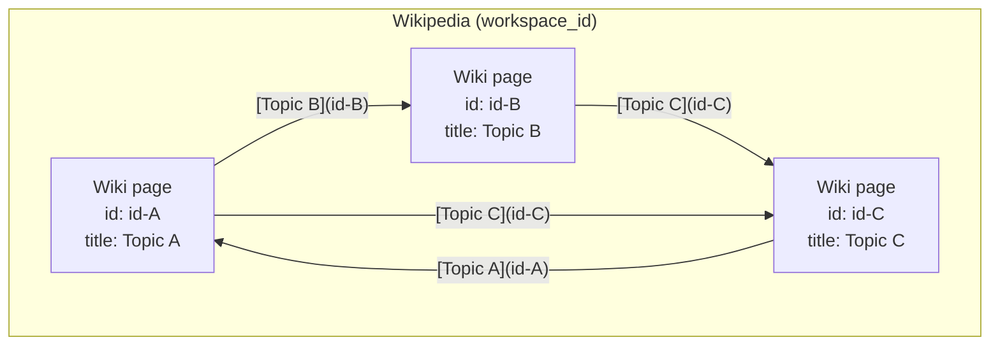

# Local Wikipedia

## Core concepts

### Wikipedia
A **Wikipedia** is the full knowledge base for one workspace: a collection of many wiki pages that are related to each other.

- Scoped to a single `workspace_id`
- Stored as markdown files under that workspace’s wiki directory
- Pages connect by referencing each other’s `id` via `[title](id)` links
- It is not one document — it is the graph of all wiki pages in that workspace

### Wiki page
A **wiki page** is one article about a single, specific topic.

- Exactly one topic per page
- Has an **infobox** (YAML frontmatter metadata) plus a markdown **body**
- Identified by a unique `id` (UUID); the file is named `{id}.md`
- Belongs to exactly one Wikipedia (workspace)

## Infobox (metadata)

Every wiki page **must** have an infobox. The infobox is the page’s frontmatter and is used for search, linking, and identity.

Required fields:

| Field | Meaning |
|-------|---------|
| `id` | Stable unique UUID. Primary handle for reading, updating, linking, and deleting. Never invent a fake id for an existing page — use the real one from search/read. |
| `title` | Short, specific name of the topic |
| `description` | One- or two-sentence summary of what the page covers |
| `tags` | List of topical keywords for discovery and relatedness |
| `created_at` | ISO timestamp set on create |
| `updated_at` | ISO timestamp refreshed on any content or metadata change |

Rules:

- Infobox describes the page; body explains the topic
- Keep title/description/tags accurate when the topic changes
- Do not put long prose in the infobox — that belongs in the body
- `id` is immutable after create

## Body

The body is markdown prose about the topic.

- Prefer clear sections (overview, details, related concepts)
- When another topic already has (or should have) its own page, link by **id** rather than duplicating full content
- Keep the page focused on its own topic; push adjacent topics to their own pages

## Cross-page references

Always reference related wiki pages with this markdown format:

```markdown
[title](id)
```

- `title` — display text (usually the target page’s title)
- `id` — the target page’s UUID

Examples:

```markdown
See also: [Photosynthesis](9c81e4d0-1234-5678-9abc-def012345678).
The process occurs in the [Chloroplast](3f2a9b1c-abcd-ef01-2345-6789abcdef01).
```

Rules:

- Prefer `[title](id)` over bare titles when an `id` is known
- Never invent an id — only link to ids discovered via search/read/create
- When creating a new related page, create it first, then link back with its real `id`

## How Wikipedia and wiki pages relate



- **Wikipedia** = the set of interrelated pages for one workspace
- **Wiki page** = one node in that set
- Relatedness is expressed by shared tags, overlapping topics, and explicit `[title](id)` links in the body

## Rules of existence

1. **One topic → one page.** If content is about a new distinct topic, create a new page. If it extends an existing topic, update that page.
2. **Search before create.** Look up existing page metadata in the workspace first. Prefer updating a matching page over creating a duplicate.
3. **Always use real ids.** Operate on pages via `workspace_id` + `wiki_page_id`. Never guess an id.
4. **Infobox always present.** A page without valid infobox fields is incomplete — create or fix metadata before relying on the page.
5. **Stay inside the workspace.** Only create/read/update/delete pages for the given `workspace_id` (that workspace’s Wikipedia).
6. **Keep the graph coherent.** When introducing a related concept, either link an existing page with `[title](id)` or create a new page and link it; avoid orphaned duplicate topics.
7. **Update timestamps conceptually.** Treat `updated_at` as reflecting the latest meaningful change to body or infobox.

## Decision guide

When ingesting new content:

1. Identify the main topic(s) in the content
2. Search the Wikipedia for matching pages (title, description, tags)
3. For each topic:
   - **Match found** → update that page’s body and/or infobox
   - **No match** → create a new wiki page with a complete infobox and focused body
4. Cross-link related pages using `[title](id)`
5. Avoid merging unrelated topics into one page

## Anti-patterns

- Creating a new page for content that already belongs on an existing page
- One giant page that tries to be the whole Wikipedia
- Missing or empty infobox fields
- Referring to pages by title only when an `id` is available
- Duplicating another page’s full content instead of linking with `[title](id)`
- Inventing or guessing UUIDs for links
