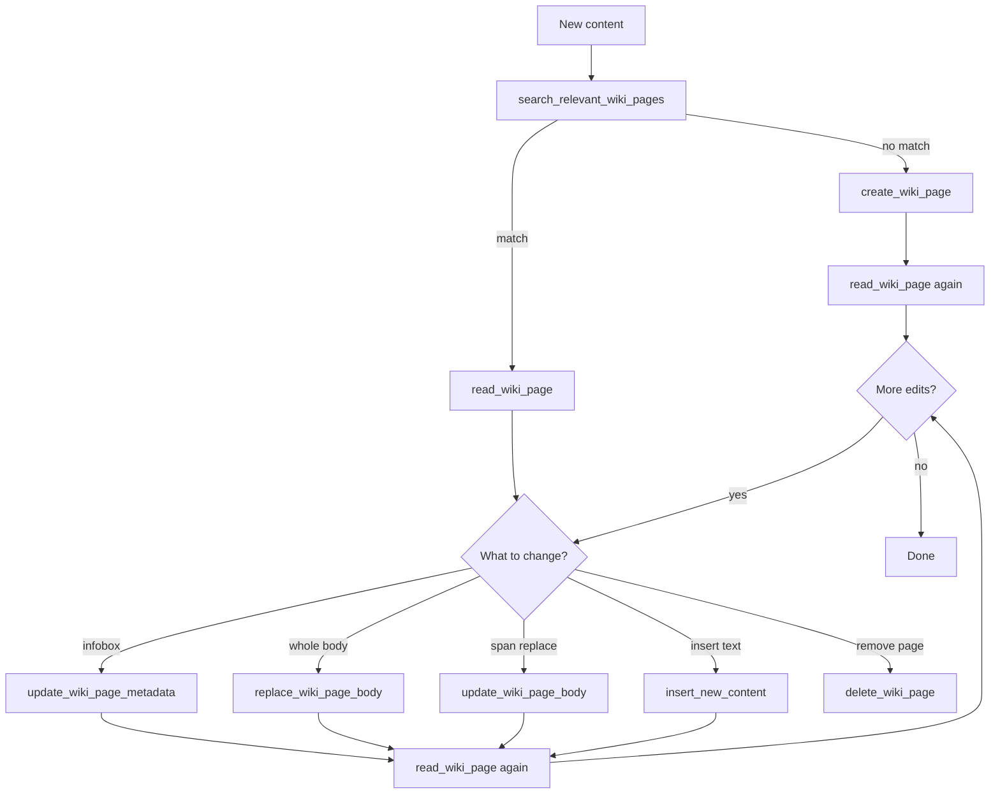

# Wiki MCP Tools

Use these tools to maintain the Wikipedia for a given `workspace_id`. Always pass the workspace id from the job context. Prefer real `wiki_page_id` values from search/read/create — never invent ids.

## Re-read after every mutation (tool hide rule)

`read_wiki_page` results are subject to a **tool hide rule**: earlier read outputs are collapsed, so you must not rely on a previous read after the page changes.

**After every create or update**, immediately call `read_wiki_page` again on that page to get the latest arrangement (structure, sections, character positions, and line numbers) before any further edit.

Applies after: `create_wiki_page`, `replace_wiki_page_body`, `update_wiki_page_body`, `insert_new_content`, `update_wiki_page_metadata`.

## Recommended workflow

When ingesting or updating content:

1. `search_relevant_wiki_pages` — find existing pages that match the topic
2. `read_wiki_page` — load full body before editing an existing page
3. Choose one:
   - **No match** → `create_wiki_page`
   - **Infobox only** → `update_wiki_page_metadata`
   - **Replace entire body** → `replace_wiki_page_body`
   - **Edit a span of body** → `update_wiki_page_body`
   - **Add text at a position** → `insert_new_content`
4. **`read_wiki_page` again** — refresh the latest page arrangement after the mutation
5. Cross-link related pages in body text with `[title](id)` (re-read again after those edits)
6. `delete_wiki_page` only when a page is obsolete or a clear duplicate



## Tool chooser

| Goal | Tool |
|------|------|
| Discover pages / get ids | `search_relevant_wiki_pages` |
| Read full page before edit **and after every mutation** | `read_wiki_page` |
| New topic page | `create_wiki_page` → then `read_wiki_page` |
| Change title, description, or tags | `update_wiki_page_metadata` → then `read_wiki_page` |
| Overwrite the entire body | `replace_wiki_page_body` → then `read_wiki_page` |
| Replace a character range in the body | `update_wiki_page_body` → then `read_wiki_page` |
| Insert text at a character index | `insert_new_content` → then `read_wiki_page` |
| Remove a page | `delete_wiki_page` |

---

## `search_relevant_wiki_pages`

**What it does:** Lists wiki page infoboxes (metadata) for the workspace so you can find related pages and their ids.

**When to use:** Always first when ingesting content; before create; whenever you need ids/titles for `[title](id)` links.

**Inputs:**
- `workspace_id` (int)
- `query` (str) — topic or keywords to search for

**Returns:** List of page metadata (`id`, `title`, `description`, `tags`, timestamps), or an error string if the workspace/wiki is missing.

**Notes:**
- Use returned `id` values for all later tools
- Metadata-only — does not return body content
- If no pages exist, create with `create_wiki_page` instead of retrying forever

---

## `create_wiki_page`

**What it does:** Creates a new wiki page file `{id}.md` with infobox + optional initial body.

**When to use:** After search shows no suitable existing page for a distinct topic.

**Inputs:**
- `workspace_id` (int)
- `metadata` — complete infobox:
  - `id` (UUID)
  - `title` (str)
  - `description` (str)
  - `tags` (list of str)
  - `created_at` / `updated_at` (optional ISO strings)
- `body` (optional str) — initial markdown body; include `[title](id)` links where relevant

**Returns:** Success message including the new wiki page id, or an error string.

**Notes:**
- One topic per page
- Provide a full infobox; do not leave title/description/tags empty
- Do not create duplicates of pages already found by search
- **After create:** call `read_wiki_page` again to see the latest page arrangement (tool hide rule)

---

## `read_wiki_page`

**What it does:** Reads one page’s metadata and full body. Body is returned with stable line numbers:

```text
00001 | # Title
00002 | Hello
```

**When to use:** Before any body edit (`replace`, `update`, or `insert`); **immediately after every create/update** to refresh the latest arrangement; whenever you need exact current content or character positions.

**Inputs:**
- `workspace_id` (int)
- `wiki_page_id` (UUID)

**Returns:** `workspace_id`, `wiki_page_id`, `metadata`, line-numbered `body`, or an error string.

**Notes:**
- Line prefixes (`NNNNN | `) are for orientation only — body edit tools apply to the raw body without those prefixes
- Earlier `read_wiki_page` results are collapsed by the tool hide rule — treat only the **latest** read as authoritative
- Never plan further edits from a stale (hidden) read; re-read after each mutation

---

## `replace_wiki_page_body`

**What it does:** Replaces the **entire** page body with the provided markdown. Infobox is kept; `updated_at` is refreshed.

**When to use:** Restructuring most/all of the page, or rewriting from scratch is simpler than many small patches.

**Inputs:**
- `workspace_id` (int)
- `wiki_page_id` (UUID)
- `body` (str) — full new body

**Returns:** Success message, or an error string.

**Notes:**
- Destructive to previous body content — prefer `update_wiki_page_body` / `insert_new_content` for small changes
- Preserve existing good `[title](id)` links when rewriting
- **After replace:** call `read_wiki_page` again to get the latest arrangement before further edits (tool hide rule)

---

## `update_wiki_page_body`

**What it does:** Replaces a **character span** of the body (`start` inclusive through `end` exclusive) with `new_content`. Returns a unified diff of applied changes. Refreshes `updated_at`.

**When to use:** Fixing, expanding, or rewriting a specific section without touching the rest.

**Inputs:**
- `workspace_id` (int)
- `wiki_page_id` (UUID)
- `update`:
  - `start` (int) — character index in raw body
  - `end` (int) — character index in raw body
  - `new_content` (str) — replacement text for that range

**Returns:** `workspace_id`, `wiki_page_id`, `applied_updates` (diff), or an error string.

**Notes:**
- Call `read_wiki_page` first to compute accurate `start`/`end` on the raw body
- Prefer this over replace for localized edits
- **After update:** call `read_wiki_page` again — indexes and layout changed; prior reads are hidden (tool hide rule)

---

## `insert_new_content`

**What it does:** Inserts `content` at `insert_index` in the raw body without deleting existing text. Returns a unified diff. Refreshes `updated_at`.

**When to use:** Adding a new paragraph, section, or `[title](id)` link at a known position.

**Inputs:**
- `workspace_id` (int)
- `wiki_page_id` (UUID)
- `insert_index` (int) — character index in raw body
- `content` (str) — text to insert

**Returns:** `workspace_id`, `wiki_page_id`, `applied_updates` (diff), or an error string.

**Notes:**
- Does not overwrite — use `update_wiki_page_body` to replace a span
- Read the page first so `insert_index` is correct
- **After insert:** call `read_wiki_page` again to refresh arrangement and positions (tool hide rule)

---

## `update_wiki_page_metadata`

**What it does:** Updates infobox fields (title, description, tags). Only provided fields change. `id` is not changed. Refreshes `updated_at`.

**When to use:** After content changes that make the summary/tags outdated, or to refine discoverability.

**Inputs:**
- `workspace_id` (int)
- `wiki_page_id` (UUID)
- `title` (optional str)
- `description` (optional str)
- `tags` (optional list of str)

**Returns:** `workspace_id`, `wiki_page_id`, `updated_metadata`, or an error string.

**Notes:**
- Does not edit the body
- Keep title/description/tags aligned with the page topic
- **After metadata update:** call `read_wiki_page` again to confirm the latest page state (tool hide rule)

---

## `delete_wiki_page`

**What it does:** Permanently deletes the wiki page file for the given id.

**When to use:** Clear duplicates, obsolete topics, or pages created in error.

**Inputs:**
- `workspace_id` (int)
- `wiki_page_id` (UUID)

**Returns:** Confirmation with ids and message, or an error string.

**Notes:**
- Irreversible — prefer merge/update when content is still useful
- After delete, remove or retarget `[title](id)` links on other pages that pointed here
- For linked pages you edit afterward, `read_wiki_page` those pages first (and again after each update)

---

## Body edit comparison

| Tool | Effect on body | Best for |
|------|----------------|----------|
| `replace_wiki_page_body` | Full overwrite | Major rewrite |
| `update_wiki_page_body` | Replace `[start:end]` | Section/sentence fix |
| `insert_new_content` | Insert at index | Add without deleting |

After any of these, always `read_wiki_page` again before the next edit.

## Hard rules

1. Always scope tools to the job’s `workspace_id`
2. Search before create; read before body edits
3. **After every create/update, `read_wiki_page` again** — tool hide rule collapses earlier reads; only the latest read reflects current arrangement
4. Never guess `wiki_page_id`
5. Use `[title](id)` for cross-page references in body text
6. Prefer the smallest body edit tool that achieves the change
7. Do not delete unless the page should not exist
